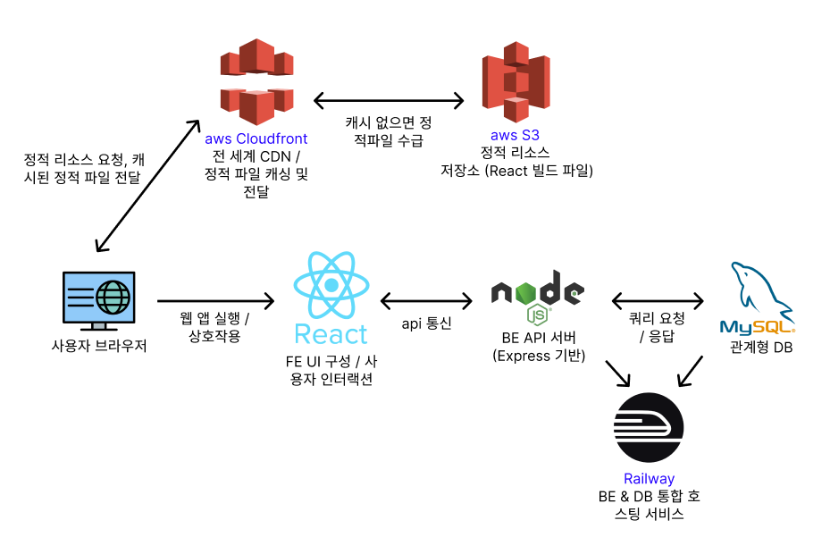

# 배달의 신 - Frontend

## 📚 목차

1. [프로젝트 소개](#프로젝트-소개)
2. [주요 역할](#주요-역할)
3. [기술 스택](#기술-스택)
4. [폴더 구조](#폴더-구조)
5. [주요 기능](#주요-기능)
6. [배포 아키텍처](#배포-아키텍처)
7. [기술적 회고 및 트러블슈팅](#기술적-회고-및-트러블슈팅)
8. [프로젝트 회고](#프로젝트-회고)

---

## 📌 프로젝트 소개
> ### 🚀 배포 URL
> [https://dv19wj9tllwf5.cloudfront.net](https://dv19wj9tllwf5.cloudfront.net)

본 디렉토리는 **배달의 신(God of Delivery)** 프로젝트의 프론트엔드 코드 및 설정을 포함하고 있습니다.  
사용자가 웹 상에서 배달 서비스를 자연스럽고 직관적으로 이용할 수 있도록,  
**UI/UX 기획, 상태 관리, 비동기 데이터 처리, 인증 흐름, 반응형 레이아웃** 등  
전반적인 프론트엔드 로직을 구현하였습니다.

본 프로젝트는 **2인 협업 프로젝트**로 진행되었으며,  
프론트엔드는 UI 및 사용자 흐름 설계, 상태 및 인증 처리, API 연동을 중심으로,  
백엔드는 RESTful API 설계, DB 모델링 및 서버 배포를 중심으로 역할을 분담하여 개발하였습니다.  
API 명세 협의 및 응답 포맷 조율, GitHub 기반 협업 경험을 통해 실무와 유사한 개발 흐름을 경험했습니다.

### 📄 디렉토리별 README 안내

본 프로젝트는 프론트엔드(front-end)와 백엔드(back-end)가 분리되어 있으며,  
각 디렉토리별로 세부 기술 스택, 구조, 실행 방법 등이 작성된 README가 존재합니다.

- 🔗 **루트 개요 및 실행 가이드**: [README.md](../README.md)
- 🔗 **백엔드 README**: [back-end/README.md](../back-end/README.md)
- 🔗 **프론트엔드 README (현재 문서)**: [front-end/README.md](./README.md)

> ⚙️ 프로젝트 실행 방법은 루트 디렉토리의 [README.md](../README.md)에서 확인할 수 있습니다.  
> 📘 API 명세는 [back-end/README.md](../back-end/README.md)에 정리되어 있습니다.
---

## 🛠️ 기술 스택

| 분류            | 기술                                             |
|---------------|------------------------------------------------|
| **프레임워크**     | React                                          |
| **라우팅**       | react-router-dom                               |
| **상태 관리**     | Recoil, TanStack Query (React Query)           |
| **폼 처리 / 검증** | React Hook Form, Yup                           |
| **스타일링**      | Styled-components, React Icons                 |
| **차트 / 시각화**  | Chart.js                                       |
| **API 통신**    | Axios                                          |
| **UX 개선**     | React Toastify, React Error Boundary           |
| **지도 API**    | react-kakao-maps-sdk                           |
| **개발 도구**     | json-server, dotenv, ESLint (Airbnb), Prettier |
| **패키지 관리**    | npm                                            |
| **버전 관리**     | Git, GitHub                                    |
| **배포 인프라**    | AWS S3, AWS CloudFront                         |

---

## 📁 폴더 구조

```
front-end/
├── build/                  # 빌드 결과물 (배포용)
├── public/                 # 정적 파일 (index.html 등)
├── src/                    # 애플리케이션 주요 소스 코드
│   ├── api/                # Axios 인스턴스 및 API 요청 함수
│   │   ├── axiosInstance.js
│   │   ├── reissueApi.js
│   │   └── request.js
│   ├── assets/             # 이미지, 공통 스타일
│   │   ├── img/
│   │   └── styles/
│   ├── components/         # 공통 UI 컴포넌트
│   │   ├── charts/         # 차트 관련 컴포넌트
│   │   ├── common/         # 공통 UI (버튼, 타이틀 등)
│   │   ├── guards/         # 인증/인가 관련 가드 컴포넌트
│   │   ├── kakaoMap/       # 카카오 지도 관련 UI
│   │   └── modal/          # 모달 UI
│   ├── constants/          # 상수 (API URL, queryKey 등)
│   ├── hooks/              # 공통 커스텀 훅
│   ├── json-server/        # mock API용 JSON 파일 등
│   ├── pages/              # 라우팅되는 주요 페이지
│   │   ├── common/
│   │   │   ├── AuthPage/
│   │   │   └── ErrorPage/
│   │   ├── owner/          # 사장님 페이지
│   │   │   ├── common/
│   │   │   ├── MenuManagementPages/
│   │   │   ├── OwnerHomePage/
│   │   │   ├── OwnerReviewPage/
│   │   │   ├── StoreManagementPage/
│   │   │   └── OwnerLayout.jsx
│   │   └── user/           # 사용자 페이지
│   │       ├── CartPage/           # 페이지 내부 디렉토리
│   │       │   ├── components/     # 페이지 전용 UI 컴포넌트
│   │       │   ├── hooks/          # 페이지 관련 커스텀 훅
│   │       │   ├── Cart.styles.js  # 스타일 정의 (styled-components)
│   │       │   └── CartPage.jsx    # 페이지 컴포넌트
│   │       ├── common/
│   │       ├── DibsPage/
│   │       ├── HomePage/
│   │       ├── ManagementPages/
│   │       ├── OrderStatusPage/
│   │       ├── PaymentPage/
│   │       ├── StorePage/
│   │       ├── StoresPage/
│   │       └── UserLayout.jsx
│   ├── react-query/        # React Query 클라이언트 설정
│   │   └── queryClient.js
│   ├── recoil/             # 전역 상태 (atoms, selectors)
│   ├── utils/              # 공통 유틸리티 함수
│   ├── validation/         # Yup 기반 유효성 검증 로직
│   └── App.jsx             
```

---

## ✅ 주요 기능

### 🧑 사용자 기능

- **음식점 목록 조회**
    - 배달 가능한 음식점 리스트 조회 및 정렬/필터링
    - (GIF 예시 첨부 예정)

- **주소 설정**
    - 카카오 지도 API를 이용해 배달 가능한 주소 검색 및 설정
    - 설정된 주소를 기반으로 음식점 목록 필터링
    - (GIF 예시 첨부 예정)

- **음식점 상세 페이지**
    - 가게 정보, 메뉴 및 옵션 확인
    - 리뷰 조회 기능 포함
    - (GIF 예시 첨부 예정)

- **장바구니 기능**
    - 메뉴 옵션 및 수량 조절 후 장바구니 담기
    - 장바구니 내에서 수정 및 삭제 가능
    - (GIF 예시 첨부 예정)

- **주문하기**
    - 장바구니에 담긴 메뉴를 한 번에 주문
    - 주문 성공 시 주문 상태 확인 가능
    - (GIF 예시 첨부 예정)

- **주문 상태 확인**
    - 사용자가 주문한 내역과 진행 상태 확인
    - (GIF 예시 첨부 예정)

- **찜하기 기능**
    - 음식점 찜/취소 및 찜한 목록 확인
    - (GIF 예시 첨부 예정)

- **리뷰 작성**
    - 주문 완료한 음식점에 리뷰 등록
    - 별점 + 텍스트 입력
    - (GIF 예시 첨부 예정)

---

### 👨‍🍳 사장님 기능

- **메뉴 CRUD**
    - 음식점별 메뉴 추가 / 수정 / 삭제
    - 옵션 포함한 복합 구조 메뉴 구성 가능
    - (GIF 예시 첨부 예정)

- **리뷰 관리**
    - 본인의 가게에 작성된 리뷰 조회 및 삭제
    - (GIF 예시 첨부 예정)

- **가게 정보 수정**
    - 가게 이름, 소개, 최소 주문 금액 등 정보 수정
    - (GIF 예시 첨부 예정)

---

### 📌 추후 예정

> 기능별 GIF 또는 이미지 예시 삽입 예정  
> 예: ``
---

## 📦 배포 아키텍처


> GitHub Actions를 활용한 CI/CD 기반 자동 배포 구조입니다.

### 🌐 프론트엔드

- **배포 환경**: AWS S3 + CloudFront
- **CI/CD 흐름**:
    1. `main` 브랜치 푸시 시 GitHub Actions 트리거
    2. `npm run build`로 정적 리소스 빌드
    3. S3에 자동 업로드
    4. CloudFront 캐시 무효화로 사용자에게 최신 리소스 제공

> ⚙️ 백엔드 배포 구조는 [back-end/README.md](../back-end/README.md)를 참고해주세요.
---

## 🧠 기술적 회고 및 트러블슈팅

- [React Query 무한 요청 문제 해결](https://yourblog.com/react-query-loop)
- [배포 시 CORS 이슈 해결하기 (S3 + CloudFront)](https://yourblog.com/s3-cors)
- [JWT 재발급 흐름 고민기](https://yourblog.com/jwt-reissue-flow)

---

## 🎯 프로젝트 회고

- 기능 하나하나를 구현하는 것보다, 전체 흐름(UX)을 설계하는 것이 더 어렵고 중요함을 느꼈다.
- 백엔드와 API 명세를 주고받으며 협업할 때 RESTful 구조를 더 깊이 이해하게 되었다.
- 상태 관리가 복잡해질수록 구조를 미리 설계하는 것의 중요성을 느꼈고, recoil → query → local의 경계를 나눠서 처리하는 습관이 생김.
- 배포 자동화와 캐시 무효화 같은 운영 측면도 고려해야 실서비스에 가까운 웹앱을 만들 수 있다는 걸 체감함.
